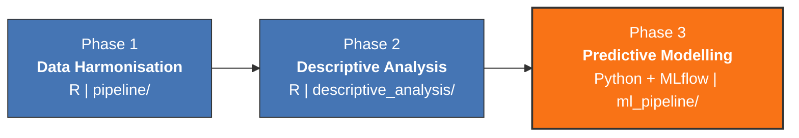
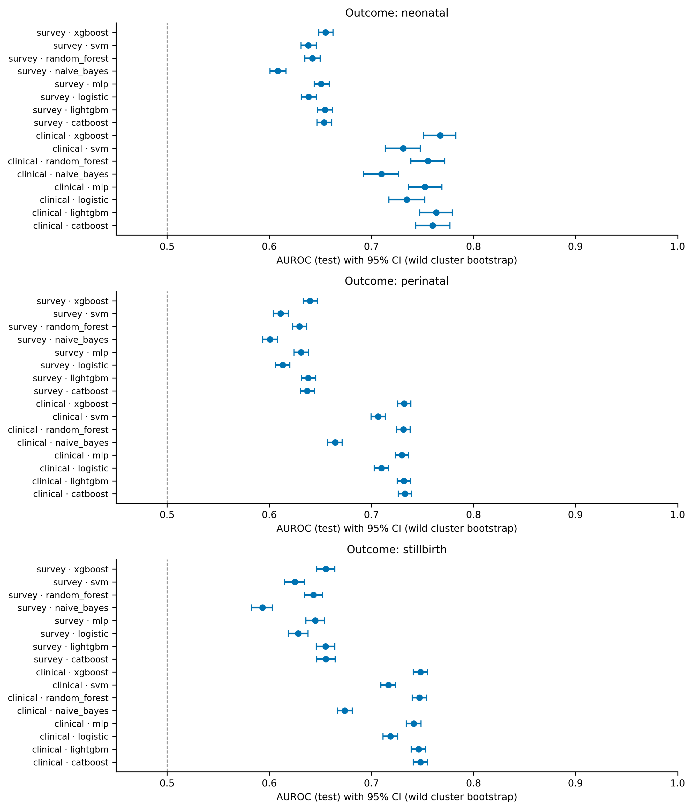

<p align="center">
  
  
  
  
  
  
  
</p>

<h1 align="center">Predictive Modelling for Stillbirths &amp; Neonatal Deaths in Sub-Saharan Africa</h1>

<p align="center"><i>Harmonising seven studies · 3.2M births · 33 countries — from raw data to leak-audited, MLflow-tracked prediction.</i></p>

<p align="center">
  <a href="https://doi.org/10.12688/wellcomeopenres.25574.1"></a>
  <a href="https://osf.io/ptf7x/overview"></a>
</p>

Reproducible analytical pipeline for data harmonisation and predictive modelling across seven contributing studies (ALERT, EN-INDEPTH, PTBi, PRECISE, WHOMCS, NCOPS, DHS). Implements a 13-domain harmonisation framework and classical, machine-learning and AI modelling approaches. Associated with a Wellcome Accelerator Award at the London School of Hygiene &amp; Tropical Medicine.

> **Contents** — [At a Glance](#at-a-glance) · [Project Phases](#project-phases) · [Phase 1 · Harmonisation](#phase-1-data-harmonisation-pipeline) · [Phase 2 · Descriptive](#phase-2-descriptive-analysis-pre-modeling) · [Phase 3 · Modelling](#phase-3-predictive-modelling) · [Version History](#version-history) · [Authors](#authors)

---

## At a Glance

```
 3,210,530 births   |   33 SSA countries   |   7 studies   |   2010-2024
      141 variables  |  13 harmonisation domains  |  v10.17 unified dataset
```

### Perinatal Outcome Rates

```
 Stillbirth Rate (SBR)          10.4 per 1,000 total births    (n = 33,394)
 Neonatal Death Rate (NND)      30.4 per 1,000 live births     (n = 96,694)
 Perinatal Mortality Rate (PMR) 40.5 per 1,000 total births    (n = 130,088)
```

### Contributing Studies

```
 ALERT        Facility-based   |   The Gambia, Kenya, Mozambique
 DHS          Population survey |   33 SSA countries
 EN-INDEPTH   HDSS cohort      |   5 countries
 NCOPS        Observational    |   Uganda
 PRECISE      Prospective      |   The Gambia, Kenya, Mozambique
 PTBi         Cluster RCT      |   Kenya, Uganda
 WHOMCS       Multi-country    |   7 SSA countries
```

---

## Project Phases



| Phase | Directory | Language | Status |
|-------|-----------|----------|--------|
| 1. Data Harmonisation | `pipeline/` | R | ✅ Complete |
| 2. Descriptive Analysis | `descriptive_analysis/` | R | ✅ Complete |
| 3. Predictive Modelling | `ml_pipeline/` | Python | 🚧 In Progress |

---

## Phase 1: Data Harmonisation Pipeline

The pipeline produces a unified analytical dataset (v10.17) from six prospective cohort studies and national DHS surveys across Sub-Saharan Africa, linked with geospatial environmental exposures. Scripts are numbered in execution order and should be run sequentially from the project root directory.

<details>
<summary><b>Execution order · utilities · legacy</b> (11 numbered steps — click to expand)</summary>

<br>

**Execution order**

| Step | Script | Description |
|------|--------|-------------|
| 01 | `pipeline/01_unified_dataset_pipeline_v10.15.Rmd` | Load and harmonise six studies (NCOPS, ALERT, PRECISE, PTBi, EN-INDEPTH, WHOMCS) into the 13-domain variable schema. Outputs `unified_dataset_v10.15.rds`. |
| 02 | `pipeline/02_dhs_pipeline_v7.2.Rmd` | Download, process and harmonise DHS Birth Recode data for all SSA countries with incremental checkpointing. Merges DHS with the 6-study dataset to produce `merged_unified_dataset_v10.16.rds`. |
| 03 | `pipeline/03_fix_dhs_geographic_linkage.R` | Download DHS GE shapefiles and link cluster-level GPS coordinates (replacing country centroids). Updates `merged_unified_dataset_v10.16.rds` with real GPS. |
| 04 | `pipeline/04_fix_dhs_labels_attendant.R` | Restore religion, ethnicity and birth attendant labels from DHS raw BR files. Updates `merged_unified_dataset_v10.16.rds` in place. |
| 05 | `pipeline/05_integrated_environmental_pipeline_v3.3.Rmd` | Extract environmental exposures (elevation, ERA5 climate, PM2.5, seasonality) from raster data. Outputs `environmental_linkage_v3.3.rds`. |
| 06 | `pipeline/06_optimized_environmental_extraction_v3.4.R` | Optimised re-extraction at ~56K unique coordinate pairs (reduces runtime from ~10h to ~30min). Outputs `environmental_linkage_v3.4.rds`. |
| 07 | `pipeline/07_join_environmental_to_unified.R` | Join environmental linkage v3.4 to the merged unified dataset. Outputs `unified_dataset_with_env_v10.16.rds`. |
| 08 | `pipeline/08_create_v10.17_clean.R` | Final cleaning: coalesce duplicate columns, standardise dates, clean gestational age, drop empty columns, reorder. Reads v10.16 and outputs `unified_dataset_with_env_v10.17_cleaned.rds`. |
| 09 | `pipeline/09_export_cleaned_dataset.R` | Export v10.17 to Stata (.dta), CSV, and generate a data dictionary (XLSX). |
| 10 | `pipeline/10_generate_documentation.R` | Generate documentation suite: DHS variable mapping, harmonisation documentation, pipeline workflow, data dictionary (4 Word/Excel files). |
| 11 | `pipeline/11_unified_dataset_analysis_v10.17.Rmd` | Comprehensive exploratory analysis report (HTML output). |

**Utilities**

| Script | Description |
|--------|-------------|
| `utilities/save_checkpoints.R` | Save DHS processing checkpoints from RStudio memory before closing session |
| `utilities/download_dhs_gis.R` | Download DHS GIS shapefiles via direct URLs and link GPS to unified dataset |
| `utilities/download_era5_fixed.py` | Download ERA5 monthly climate data from Copernicus CDS API |
| `utilities/export_missingness_report.R` | Generate variable-level missingness report (XLSX) for v10.17 |
| `utilities/compare_v15_v17.R` | Validation: compare v10.15 vs v10.17 (GA, environmental data, column counts) |

**Legacy**

| Script | Description |
|--------|-------------|
| `legacy/outcomes_harmonisation_v7.do` | Stata do-file for outcomes variable harmonisation (historical reference) |

</details>

---

## Phase 2: Descriptive Analysis (Pre-Modeling)

Comprehensive characterisation of the unified dataset prior to predictive modelling. Generates an interactive HTML report, Excel workbook, and PowerPoint presentation.

| Script | Description |
|--------|-------------|
| `descriptive_analysis/LSHTM_Descriptive_PreModeling_Report.Rmd` | Main report: Tables 1--3, outcome epidemiology, covariate distributions, missingness, pre-modeling readiness. Outputs HTML + Excel + PPTX. |
| `descriptive_analysis/render_report.R` | Rendering wrapper for the Rmd report |
| `descriptive_analysis/EDA_df_ssa_from2010_pipeline_v2.R` | Standalone EDA pipeline for the SSA 2010+ subset |
| `descriptive_analysis/SSA_StudyType_Descriptive_Pipeline.R` | Study-type stratified descriptive pipeline |

### Key Findings

- **Stillbirth rate:** 10.4 per 1,000 total births (n = 33,394)
- **Neonatal death rate:** 30.4 per 1,000 live births (n = 96,694)
- **Perinatal mortality rate:** 40.5 per 1,000 total births (n = 130,088)
- DHS contributes ~85% of records; significant heterogeneity across study sources
- Bivariate analyses (Table 2) confirm maternal age, birthweight, and gestational age as significantly associated with both stillbirth and neonatal death (p < 0.001)
- Data completeness varies markedly by study: core variables (age, GA, BW) available in >70% of records globally

### Report Output Summary

| Output | Contents |
|--------|----------|
| **HTML Report** | 13 sections: executive summary, geographic map, study composition, outcome epidemiology, maternal/birth characteristics, cross-tabulations, Tables 1--3, covariate heatmap, missingness, pre-modeling readiness, environmental variables |
| **Excel Workbook** | 10 sheets: study distribution, overview, covariate availability, candidates, inventory, readiness, missingness, outcomes, Table 2a (SB), Table 2b (NND) |
| **PowerPoint** | 13 slides: title, summary, study sizes, SSA map, outcome rates, birth distributions, ridgelines, readiness, candidates, heatmap, cross-tabs, key findings, recommendations |

See [`descriptive_analysis/README.md`](descriptive_analysis/README.md) for full details and instructions.

---

## Phase 3: Predictive Modelling

  

Classical, ensemble and neural-network models for **stillbirth**, **neonatal** and **perinatal death** prediction, built on the harmonised unified dataset. The pipeline is leak-audited, cross-validated, calibrated, and fully **tracked with MLflow** for reproducible experiments. Implementation in Python under [`ml_pipeline/`](ml_pipeline/).

### Models (8 algorithms)

| Algorithm | Type |
|---|---|
| Logistic Regression (L2) | Baseline (interpretable) |
| Gaussian Naive Bayes | Probabilistic baseline |
| Linear SVM (SGD, modified-Huber) | Margin-based |
| Random Forest | Ensemble |
| XGBoost · LightGBM · CatBoost | Gradient boosting |
| MLP (Optuna-tuned) | Neural network |

### Two-arm design & predictors

Rather than fixed clinical scenarios, models use **parsimonious, SSA-feasible predictor sets** matched to what each data source actually carries — organised into two arms:

| Arm | Sources | Predictors |
|---|---|---|
| **A · Survey** | DHS + EN-INDEPTH | maternal age, twin, education, residence, wealth quintile, country, GDP, MMR |
| **B · Clinical** | ALERT, PTBi, PRECISE, WHOMCS, NCOPS | maternal age, parity, twin, BMI, gestational age, ANC visits, country, GDP, MMR |

- **Outcomes:** stillbirth · neonatal death · perinatal death (each modelled per arm).
- **Leak-audited:** survey stillbirth/perinatal include DHS using `out_multiple` (twin) **instead of parity** — DHS stillbirth parity is a reproductive-calendar count (value leak); twin is measurement-consistent. Survey neonatal (livebirths) keeps real lifetime parity.
- **Country-year context:** GDP (US$) and maternal mortality ratio, linked by study year (leak-safe).
- Neonatal models add infant sex; clinical neonatal adds birthweight and delivery mode.

### Pipeline steps

1. Data loading, SSA filter, year ≥ 2010
2. **Nested cross-validation** (5-fold outer × 3-fold inner) with SMOTE for class imbalance
3. **Calibration** assessment (CITL, calibration slope, E/O ratio)
4. **Decision Curve Analysis** (clinical net benefit)
5. **SHAP** feature importance and interpretation
6. **Internal–External Cross-Validation** (Leave-One-Country-Out) for transportability
7. **Fairness / subgroup** analysis

### Experiment tracking with MLflow

Every run is logged to **MLflow** — parameters, metrics (AUROC, AUPRC, Brier, calibration slope), artefacts (SHAP plots, calibration curves, ROC/PR), and the fitted models — so experiments are versioned, comparable, and reproducible.

```bash
cd ml_pipeline
conda run -n base python run_modeling_pipeline.py     # all models x arms x outcomes, logs to MLflow
python generate_figures_tables.py                     # figures + tables from the tracked runs
mlflow ui                                             # inspect runs at http://localhost:5000
```

| Directory | Contents |
|---|---|
| `ml_pipeline/run_modeling_pipeline.py` | End-to-end training, CV, calibration, DCA, SHAP, IECV, fairness |
| `ml_pipeline/generate_figures_tables.py` | Publication figures and performance tables |
| `ml_pipeline/outputs_ML_results/` | Results, methodology references, MLflow artefacts |
| `ml_pipeline/figures/` | AUROC / calibration / ROC-PR / DCA / SHAP / external figures |
| `ml_pipeline/tables/` | Performance, extended metrics, external, per-country, fairness tables |

### Results (interim, raw v10.18)

Discrimination (AUROC) across 8 models × 2 arms × 3 outcomes, with 1000× cluster-bootstrap confidence intervals:

<p align="center">
  
</p>

| Arm | Stillbirth | Neonatal | Perinatal |
|---|:--:|:--:|:--:|
| **Survey** (DHS + EN-INDEPTH) | 0.66 | 0.66 | 0.64 |
| **Clinical** (facility cohorts) | 0.75 | **0.77** | 0.73 |

Best model = gradient boosting (XGBoost / CatBoost). **External validation:** clinical boosting up to **0.85** (India + Pakistan). Operating-point metrics (Se, Sp, PPV, NPV, F1, F2, MCC at the Youden threshold), per-country AUROC, and fairness by subgroup are in [`ml_pipeline/tables/`](ml_pipeline/tables/); all figures in [`ml_pipeline/figures/`](ml_pipeline/figures/).

See [`ml_pipeline/README.md`](ml_pipeline/README.md) for full model specifications and usage.

---

## Configuration

All scripts that require a base path detect the current user and set paths accordingly. If running on a new machine, either:

1. Set your working directory to the project root before running scripts, or
2. Edit the `base_path` / `dropbox_base` variable at the top of each script.

Scripts 01, 05 and 11 use relative paths by default and require no configuration.

## Version History

| Version | Description |
|---------|-------------|
| **v10.17** (current) | Final cleaned dataset with standardised dates, coalesced duplicate columns, cleaned gestational age values, and logically ordered columns (~130 variables) |
| **v10.16** | Added real DHS cluster-level GPS coordinates (replacing country centroids), restored DHS religion/ethnicity/birth attendant labels |
| **v10.15** | Base unified dataset merging six prospective studies with DHS data and environmental variable placeholders |

Environmental pipeline versions: v3.4 (optimised extraction at unique coordinates), v3.3 (complete integrated extraction), v3.2/v3.1 (earlier iterations)

## Data Access

Individual-level data from the contributing studies are not publicly available due to ethical restrictions. DHS data can be requested from the [DHS Program](https://dhsprogram.com/).

## Associated Resources

- **OSF:** <https://osf.io/ptf7x/overview>
- **DOI:** [10.12688/wellcomeopenres.25574.1](https://doi.org/10.12688/wellcomeopenres.25574.1)

## Authors

| Name | Role | Affiliation |
|------|------|-------------|
| **Joseph Akuze** | Principal Investigator | London School of Hygiene & Tropical Medicine |
| **Audencio Victor** | Health Data Scientist | London School of Hygiene & Tropical Medicine |

## Licence

MIT
